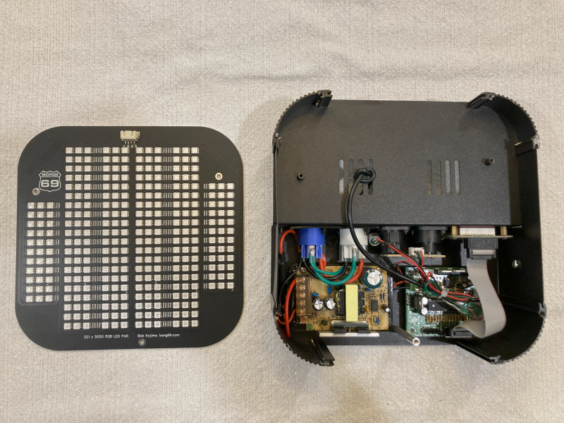
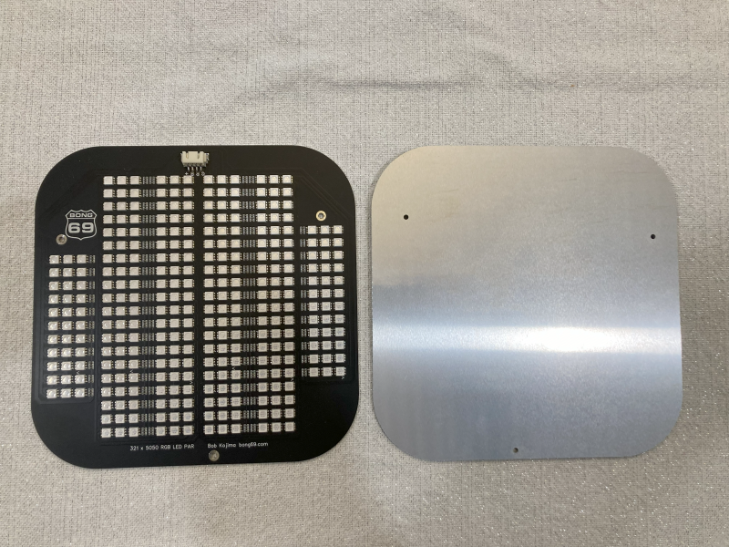
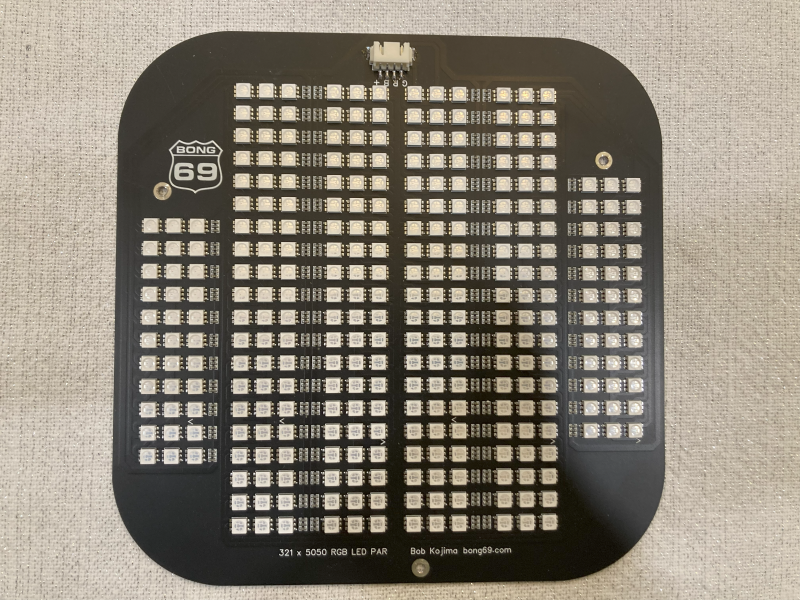
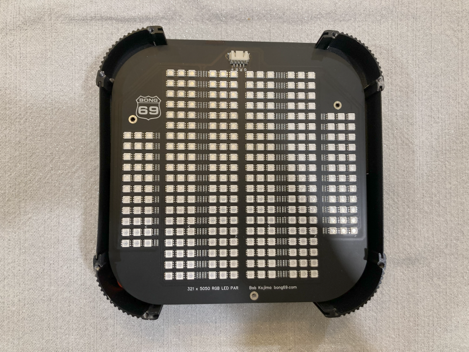
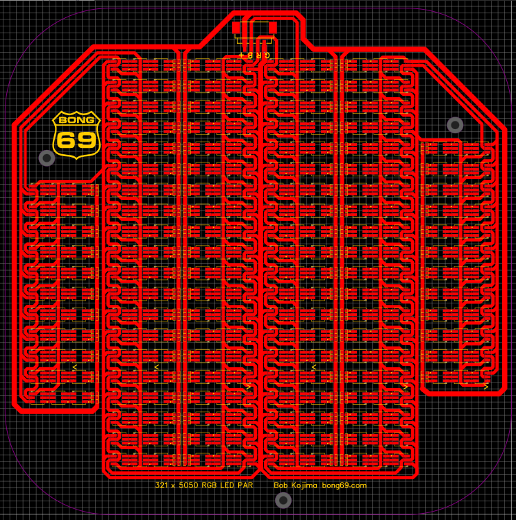
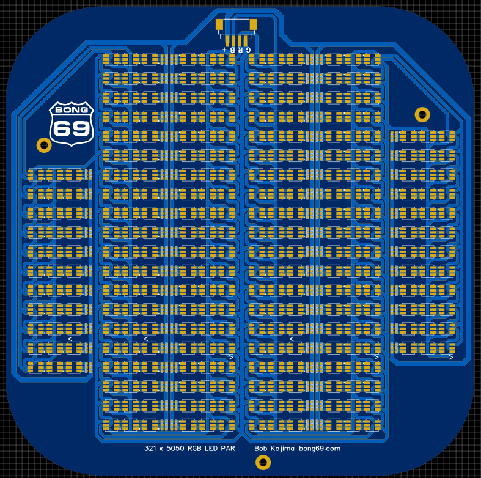
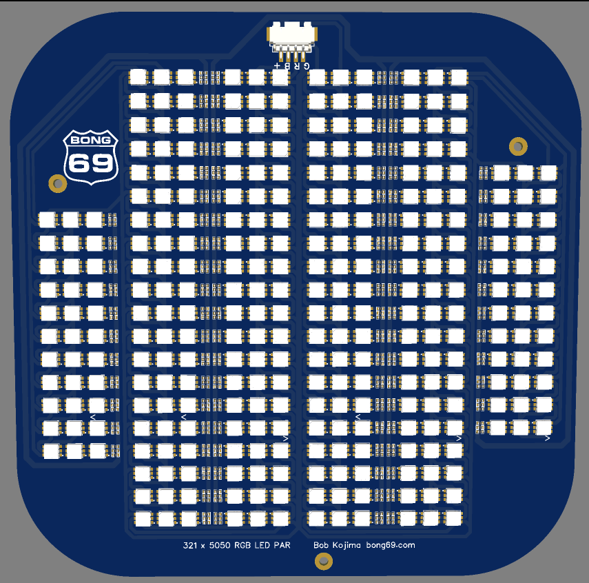

# 5050_RGB_LED_PAR

This is an LED PAR light with 321 x 5050 RGB LEDs (lcsc.com part number C784540).  It needs a 12V 5A power supply and PWM to drive it.  These are not smart LEDs.  All 321 leds are connected together so they will all be set to the same color when you drive them with a PWM signal.  The connector on the board has pins for 12V, Red, Green, and Blue.

I was trying to upgrade some old par lights I have.  My goal was to replace only the led PCB and keep/reuse the dmx receiver board and the power supply.  Well the new led pcb needed more power and now it also needs cooling.  The old case is too small for both.

Im posting the Gerber files in case someone has a need for a board like this.

I had some of these boards manufactured on aluminum and will have them for sale in my tindie store.  I will add the link when I get that set up.

